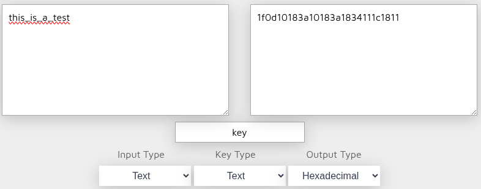
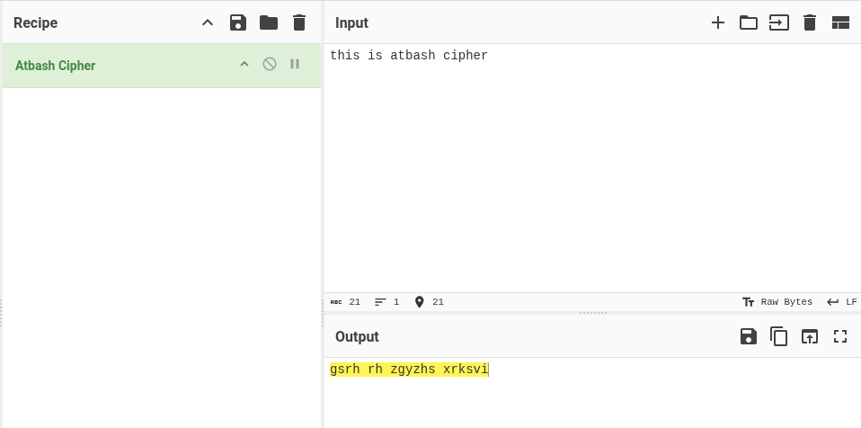
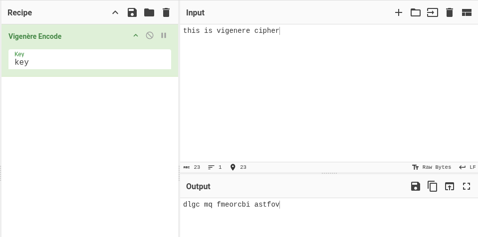
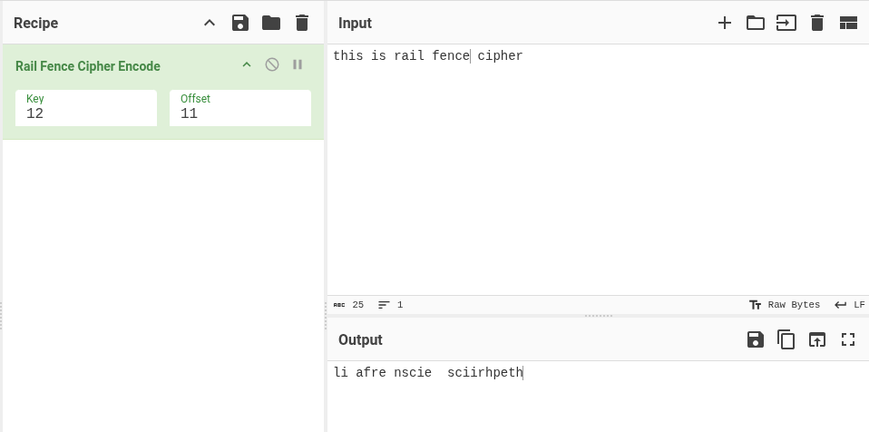
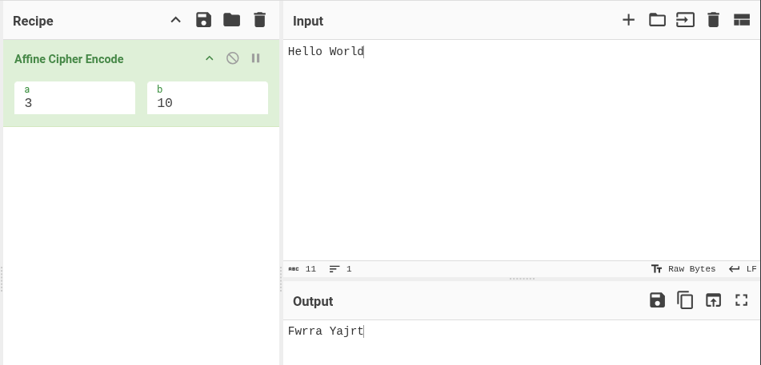
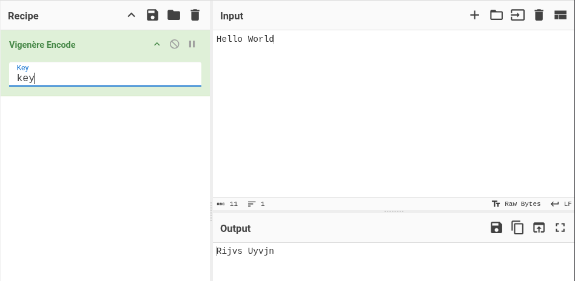

# Aletheia

Aletheia is a command-line tool designed to perform **decode or brute-force attacks on common ciphers**. It helps you quickly test and decode encrypted text using several classical cryptographic techniques.

---

## 🧠 Why Aletheia?

The name **Aletheia** comes from the Greek word meaning *truth* or *unconcealment*. The tool aims to reveal hidden messages and uncover the truth behind encrypted text.


---

## ✨ Features

- Brute force decryption for multiple classical ciphers
- Simple and intuitive CLI interface
- Useful for CTF's, cryptography learning, and quick cipher analysis

Supported ciphers:
- xor
- atbash
- vigenere
- rail fence
- xor brute force (based on key length)
- rot13 brute force
- rot47 brute force
- affine brute force
- vigenere brute force (based on key length)
- rail fence brute force

---

## 🛠 Requirements

- Python3
- pyinstaller (if you need a binary)

---

## 📦 Installation

Clone the repository and create a binary:
```bash
sudo apt-get install python3 pyinstaller
git clone https://github.com/1r0nx/aletheia.git
cd aletheia
chmod +x build.sh
./build.sh
sudo cp dist/aletheia /usr/bin/
```
You can now use it as a simple linux commands!

Or 

Clone the repository and make the script executable:

```bash
git clone https://github.com/1r0nx/aletheia.git
cd aletheia/src
chmod +x aletheia.py
./aletheia.py
```

---

### Global Help

```text
❯ aletheia 

                                                                ##              
   :##:    ####                          ##                     ##              
    ##     ####                  ##      ##                     ##              
   ####      ##                  ##      ##                                     
   ####      ##       .####:   #######   ##.####    .####:    ####      :####   
  :#  #:     ##      .######:  #######   #######   .######:   ####      ######  
   #::#      ##      ##:  :##    ##      ###  :##  ##:  :##     ##      #:  :## 
  ##  ##     ##      ########    ##      ##    ##  ########     ##       :##### 
  ######     ##      ########    ##      ##    ##  ########     ##     .####### 
 .######.    ##      ##          ##      ##    ##  ##           ##     ## .  ## 
 :##  ##:    ##:     ###.  :#    ##.     ##    ##  ###.  :#     ##     ##:  ### 
 ###  ###    #####   .#######    #####   ##    ##  .#######  ########  ######## 
 ##:  :##    .####    .#####:    .####   ##    ##   .#####:  ########    ###.## 
    
usage: aletheia [-h] {xor,atbash,vigenere,rail_fence,xor_brute,rot13_brute,rot47_brute,affine_brute,vigenere_brute,rail_fence_brute} ...

decode or brute force some substitution ciphers

positional arguments:
  {xor,atbash,vigenere,rail_fence,xor_brute,rot13_brute,rot47_brute,affine_brute,vigenere_brute,rail_fence_brute}
    xor                 decode xor cipher
    atbash              decode atbash cipher
    vigenere            decode vigenere cipher
    rail_fence          decode rail fence cipher
    xor_brute           brute force xor cipher
    rot13_brute         brute force rot13 cipher
    rot47_brute         brute force rot47 cipher
    affine_brute        brute force affine cipher
    vigenere_brute      brute force vigenere cipher
    rail_fence_brute    brute force rail fence cipher

options:
  -h, --help            show this help message and exit
```

---

## 🔓 Cipher Modules

### -XOR
XOR Decoder


```bash
❯ aletheia xor -s "1f0d10183a10183a1834111c1811" -k key

XOR Result: this_is_a_test
```

```bash
❯ aletheia xor -s "1f0d10183a10183a1834111c1811" -k 6B6579

XOR Result: this_is_a_test
```

```bash
❯ aletheia xor -s "1f0d10183a10183a1834111c1811" -k "011010110110010101111001"

XOR Result: this_is_a_test
```

### -Atbash

```bash
❯ aletheia atbash -s "gsrh rh zgyzhs xrksvi" 
```
Output:
```bash
this is atbash cipher
```

### -Vigenère Cipher

```bash
❯ aletheia vigenere -s "dlgc mq fmeorcbi astfov" -k key
```

Output:
```bash
this is vigenere cipher
```

### -Rail fence

```bash
❯ aletheia rail_fence -s "li afre nscie  sciirhpeth" -k 12 -o 11
```

Output:
```bash
this is rail fence cipher
```

### -XOR Brute force
Brute force xor based on key length


```bash
❯ aletheia xor_brute -s "1f0d10183a10183a1834111c1811" -l 3 | grep key
```

Output:
```bash
[+] Total keys to test: 1,000,000
[+] Bruteforcing XOR keys of length 3...
101530 KEY = b'afu'  ->  b'~key\\ey\\mUwiyw'
...
201434 KEY = b'key'  ->  b'this_is_a_test'
....
923890 KEY = b'}C{'  ->  b'bNkeykeycIRgeR'
```

### -ROT13
Brute force ROT13 substitution.
```bash
./aletheia.py rot13_brute -s "Uryyb Jbeyq"
```

Output:
```text
 0: Uryyb Jbeyq
...
...
13: Hello World
...
...
25: Tqxxa Iadxp

```


### -ROT47
Brute force ROT47 transformation.
```bash
./aletheia.py rot47_brute -s "w6==@ (@C=5P"
```

Output:
```text
 0: w6==@ (@C=5P
...
...
47: Hello World!
...
...
93: v5<<? '?B<4O
```


### -Affine Cipher
Attempts all valid affine key combinations.

```bash
./aletheia.py affine_brute -t "Fwrra Yajrt"
```

Output:
```text
a =  1, b =  0 -> Fwrra Yajrt
a =  1, b =  1 -> Evqqz Xziqs
...
...
a =  9, b = 10 -> Hello World
...
...
a = 25, b = 24 -> Tchhy Ayphf
a = 25, b = 25 -> Udiiz Bzqig
```

### -Vigenère Bruteforce
Bruteforces possible keys based on length provided. 1 < len(key) < 5.

```bash
./aletheia.py vigenere_brute -s "Rijvs Uyvjn" -l 3
```

Output:
```bash
[+] Test of 17576 possible keys...
[possible_key=aaa] Rijvs Uyvjn
[possible_key=aab] Riivs Tyvin
...
...
[possible_key=key] Hello World
...
...
[possible_key=zzy] Sjlwt Wzwlo
[possible_key=zzz] Sjkwt Vzwko
```

### -Rail Fence Cipher Brute force
Tests various rail counts and offset.

```bash
aletheia rail_fence_brute -s "li afre nscie  sciirhpeth"
```

Output:
```text
key = 002 | period = 000 || output = l i  sacfirier hnpsectihe
key = 002 | period = 001 || output = el i  sacfirier hnpsectih
...
...
key = 012 | period = 011 || output = this is rail fence cipher
...
...
key = 024 | period = 044 || output = ail fre nscie  sciirhpeth
key = 024 | period = 045 || output = il afre nscie  sciirhpeth
```

---

## 📜 License

MIT License.

---

## 🤝 Contributing

Contributions or suggestions are welcome! Feel free to submit issues or pull requests.