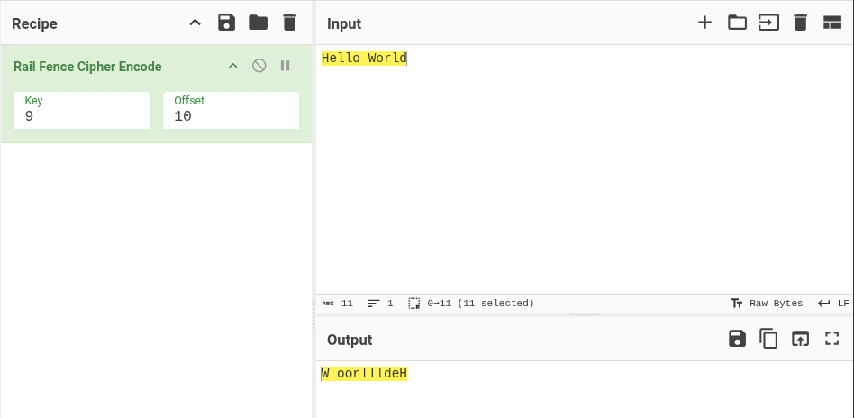

# Aletheia

Aletheia is a command-line tool designed to perform **brute-force attacks on common substitution ciphers**. It helps you quickly test and decode encrypted text using several classical cryptographic techniques.

---

## 🧠 Why Aletheia?

The name **Aletheia** comes from the Greek word meaning *truth* or *unconcealment*. The tool aims to reveal hidden messages and uncover the truth behind encrypted text.


---

## ✨ Features

- Brute force decryption for multiple classical ciphers
- Simple and intuitive CLI interface
- Useful for CTF's, cryptography learning, and quick cipher analysis

Supported ciphers:
- ROT13
- ROT47
- Affine
- Vigenère
- Rail Fence

---

## 📦 Installation

Clone the repository and make the script executable:

```bash
git clone https://github.com/1r0nx/aletheia.git
cd aletheia
chmod +x aletheia.py
./aletheia.py
```

Or create a binary:
```bash
sudo apt-get isntall python3 pyinstaller
git clone https://github.com/1r0nx/aletheia.git
cd aletheia
chmod +x build.sh
./build.sh
```
The executable will be in dist/
You can copy it and use it as a simple linux commands!

---

## 🚀 Usage

```bash
./aletheia.py [-h] {rot13,rot47,affine,vigenere,rail_fence} options
```

### Global Help

```bash
./aletheia.py
```

Output:
```text
                                                                ##              
   :##:    ####                          ##                     ##              
    ##     ####                  ##      ##                     ##              
   ####      ##                  ##      ##                                     
   ####      ##       .####:   #######   ##.####    .####:    ####      :####   
  :#  #:     ##      .######:  #######   #######   .######:   ####      ######  
   #::#      ##      ##:  :##    ##      ###  :##  ##:  :##     ##      #:  :## 
  ##  ##     ##      ########    ##      ##    ##  ########     ##       :##### 
  ######     ##      ########    ##      ##    ##  ########     ##     .####### 
 .######.    ##      ##          ##      ##    ##  ##           ##     ## .  ## 
 :##  ##:    ##:     ###.  :#    ##.     ##    ##  ###.  :#     ##     ##:  ### 
 ###  ###    #####   .#######    #####   ##    ##  .#######  ########  ######## 
 ##:  :##    .####    .#####:    .####   ##    ##   .#####:  ########    ###.## 
    
usage: aletheia.py [-h] {rot13,rot47,affine,vigenere,rail_fence} ...

brute force of some substitution ciphers

positional arguments:
  {rot13,rot47,affine,vigenere,rail_fence}
    rot13               brute force rot13 cipher
    rot47               brute force rot47 cipher
    affine              brute force affine cipher
    vigenere            brute force vigenere cipher
    rail_fence          brute force rail fence cipher

options:
  -h, --help            show this help message and exit


```

---

## 🔓 Cipher Modules

### ROT13
Brute force ROT13 substitution.
```bash
./aletheia.py rot13 -s "Uryyb Jbeyq"
```

Output:
```text
 0: Uryyb Jbeyq
...
...
13: Hello World
...
...
25: Tqxxa Iadxp

```


### ROT47
Brute force ROT47 transformation.
```bash
./aletheia.py rot47 -s "w6==@ (@C=5P"
```

Output:
```text
 0: w6==@ (@C=5P
...
...
47: Hello World!
...
...
93: v5<<? '?B<4O
```


### Affine Cipher
Attempts all valid affine key combinations.

```bash
./aletheia.py affine -t "Fwrra Yajrt"
```

Output:
```text
a =  1, b =  0 -> Fwrra Yajrt
a =  1, b =  1 -> Evqqz Xziqs
...
...
a =  9, b = 10 -> Hello World
...
...
a = 25, b = 24 -> Tchhy Ayphf
a = 25, b = 25 -> Udiiz Bzqig
```


### Vigenère Cipher
Bruteforces possible keys based on length provided. 1 < len(key) < 5.

```bash
./aletheia.py vigenere -s "Rijvs Uyvjn" -l 3
```

Output:
```text
[+] Test of 17576 possible keys...
[possible_key=aaa] Rijvs Uyvjn
[possible_key=aab] Riivs Tyvin
...
...
[possible_key=key] Hello World
...
...
[possible_key=zzy] Sjlwt Wzwlo
[possible_key=zzz] Sjkwt Vzwko
```


### Rail Fence Cipher
Tests various rail counts and offset.

```bash
./aletheia.py rail_fence -s "W oorllldeH"
```

Output:
```text
key = 002 | period = 000 || output = Wl lodoerHl
key = 002 | period = 001 || output = lWl lodoerH
...
...
key = 010 | period = 012 || output = Hello World
...
...
key = 010 | period = 016 || output = o WorllldeH
key = 010 | period = 017 || output =  WoorllldeH
```

---

## 🛠 Requirements

- Python3
- pyinstaller (if you need a binary)

---

## 📜 License

MIT License.

---

## 🤝 Contributing

Contributions or suggestions are welcome! Feel free to submit issues or pull requests.